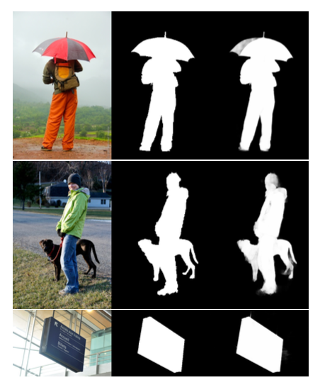
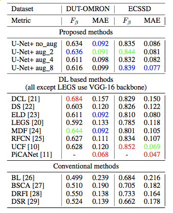
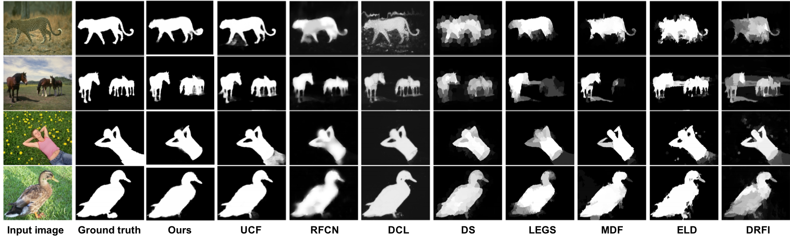

# U-Net+: Plain U-Net for saliency detection - Tensorflow implementation

This method was implemented for my final project on Computer Vision course.

[Paper that explains the method](https://drive.google.com/file/d/1sOYqo4UwCDvtO1ayGgQgY2TimzjXQK0O/view?usp=sharing)

## Results





## Getting Started

This code was tested with Python 2.7. It is highly recommended to use the GPU version of Tensorflow for fast training.

### Prerequisites
```
numpy==1.14.5
tensorflow==1.10.0
Pillow==5.4.1
```

## Training the network

### traning dataset
- Download MSRA10K dataset from [here](http://mmcheng.net/msra10k/)
- Unzip their folder and make sure images and saliency maps are all in one folder (you can call this folder ‘Imgs’).
- Put this folder into ./data/
- Use training_dataset_resize.py to resize all the images to 256x256. The process is automatic, just make sure that you give correct path to data_path variable.

### validation dataset
- Download MSRA-B dataset from [here](http://mmcheng.net/msra10k/)
- Unzip their folder and make sure images and saliency maps are all in one folder (you can call this folder ‘MSRA-B’).
- Put this folder into ./data/

Now you can train using:
```
python2 main_UNET_plus.py --phase train --train_set ./data/Imgs_256 --valid_set ./data/MSRA-B
```
Make sure to indicate correct paths. You can also add optional arguments such as cost, batch_size, aug_scale. More info inside the code.

The checkpoints are saved in ./checkpoint folder. Denoised validation images are saved after each epoch in ./sample folder.

### Tensorboard summaries
```
tensorboard --logdir=./logs
```
## Testing using the trained network
### testing dataset (DUT-OMRON)
- Download DUT-OMRON dataset from [here](http://saliencydetection.net/dut-omron/#outline-container-org13291b3)
- Unzip their folders and make sure images and saliency maps are all in one folder (you can call this folder ‘DUT-OMRON’).
- Put this folder into ./data/

### testing dataset (ECSSD)
- Download ECSSD dataset from [here](http://www.cse.cuhk.edu.hk/leojia/projects/hsaliency/dataset.html)
- Unzip their folder and make sure images and saliency maps are all in one folder (you can call this folder ‘ECSSD’).
- Put this folder into ./data/

### checkpoints
- Download checkpoints from [here](https://drive.google.com/drive/folders/1kVGuOvgozg3AC-xN5-DHAo3fy2FdsoQZ?usp=sharing)
- Put them in checkpoints/ folder. You don’t need to download all of them.

Now you can test using (e.g. ECCSD dataset):
```
python2 main_UNET_plus.py --phase test --test_set ./data/ECSSD --aug_scale 2
```
aug_scale decides which one of the checkpoints you choose.
Denoised images are saved in ./test folder.


